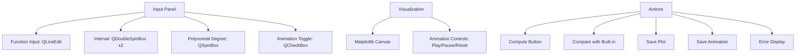
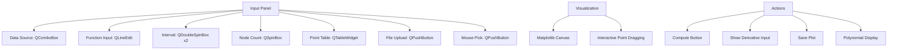
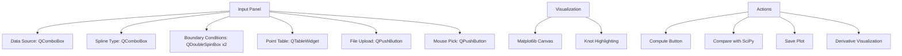

### **UI Element Breakdown per Tab**

#### **Tab 1: Bernstein Approximation**


#### **Tab 2: Lagrange Interpolation**


#### **Tab 3: Cubic Splines**


### **Essential UI Elements Checklist**

#### **All Tabs**
1. **Matplotlib Canvas** with navigation toolbar
2. **Status Bar** for error messages
3. **Theme Selector** (light/dark mode)
4. **Help Button** with context-sensitive documentation
5. **Export Controls** (PNG/SVG/CSV)

#### **Bernstein-Specific**
- Animation frame slider
- Real-time error display (‖f - Bₙ‖)
- Bernstein polynomial expression display
- Toggle for scaled vs unscaled view

#### **Lagrange-Specific**
- Node type selector (equidistant/Chebyshev)
- Derivative order input
- Barycentric formula toggle
- Runge phenomenon warning indicator

#### **Spline-Specific**
- Spline continuity indicators (C⁰/C¹/C²)
- Knot position editor
- Tension parameter control
- Boundary condition presets

### **Critical Implementation Notes**

1. **Use QThread for Computations**
```python
class ComputeThread(QThread):
    finished = pyqtSignal(object)
    
    def run(self):
        result = heavy_computation()
        self.finished.emit(result)
```

2. **Interactive Plot Elements**
```python
def on_pick(event):
    artist = event.artist
    x, y = artist.get_data()
    ind = event.ind[0]
    self.dragging_point = (artist, ind)
    
canvas.mpl_connect('pick_event', on_pick)
```

3. **Input Validation**
```python
validator = QDoubleValidator(-1000, 1000, 5)
line_edit.setValidator(validator)
line_edit.textChanged.connect(validate_input)

def validate_input():
    if not line_edit.hasAcceptableInput():
        line_edit.setStyleSheet("border: 1px solid red")
```

4. **Smart Polynomial Display**
```python
def format_polynomial(coeffs):
    terms = []
    for i, c in enumerate(coeffs):
        if abs(c) > 1e-4:
            terms.append(f"{c:.4f}x^{i}")
    return " + ".join(terms).replace("x^0", "").replace("x^1", "x")
```

5. **Efficient Animation Handling**
```python
def update_frame(n):
    ax.clear()
    B = bernstein(f, a, b, n, x)
    line, = ax.plot(x, B, 'r-')
    return line,

ani = FuncAnimation(fig, update_frame, frames=range(1,21), 
                   blit=True, interval=200)
```

### **Key Visual Elements**
1. **Bernstein Animation**  
   

2. **Lagrange Point Editing**  
   

3. **Spline Continuity Visualization**  
   

This UI design provides maximum functionality while maintaining simplicity through:
- Consistent layout across tabs
- Progressive disclosure of advanced options
- Context-sensitive help
- Visual feedback for all interactions
- Performance optimizations for smooth animation

The implementation should prioritize:
1. Core algorithm completeness
2. Responsive visualization
3. Robust input handling
4. Meaningful error feedback
5. Comparison functionality
